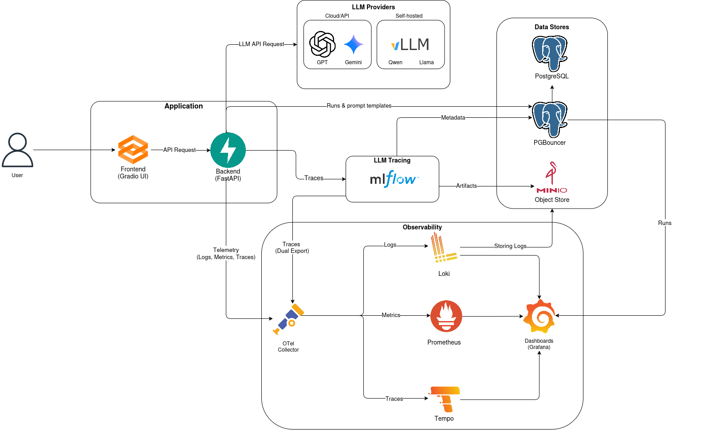

# Prompt Engineering Playground

## What is this?

**Prompt Engineering Playground** is a hands-on learning and experimentation project for building a **simple LLM-powered chatbot end-to-end**.
It is **not a production product**, but a sandbox to practice real-world LLM application architecture and tooling.

### The project includes:

- **Core application**
  - FastAPI backend for chat and streaming responses
  - Gradio-based web UI
  - Modular LLM provider adapters (external APIs and local models)

- **LLM & experimentation**
  - Features for in-app experimentation: parameter tuning, prompt templates, tool calling, structured output, and more
  - MLflow integration for experiment tracking

- **Data & storage**
  - PostgreSQL for application data
  - MinIO for artifact and object storage

- **Observability & monitoring**
  - OpenTelemetry for tracing and metrics
  - Grafana for visualization
  - Tempo for distributed tracing
  - Loki for logs
  - Prometheus for metrics collection

- **Infrastructure & deployment**
  - Fully containerized setup using Docker Compose
  - Local development environment
  - Production-like deployment support on AWS EC2 via included scripts and compose configuration
  - CI/CD pipelines to automate code quality checks, security scanning, Docker image build, versioning, pushing to registries, and automated deployments on AWS EC2s.
  - Pre-commit hooks for fast local feedback (formatting/linting, type checks, and basic hygiene checks)

---

## Repository Overview
A high-level tour of the project structure and the responsibility of each major directory.

- `adapters/`: LLM provider integrations (adapter layer to talk to external APIs / backends in a consistent way).
- `api/`: FastAPI applications and HTTP endpoints (chat APIs, streaming, health checks, docs).
- `config/`: YAML configuration for models/tools plus local vLLM config files.
- `infra/`: Docker/Compose, images, monitoring stack configs, and AWS/EC2 deploy assets.
- `models/`: SQLAlchemy-based data models and ORM layer for the app (e.g., schemas for prompts, runs, etc.).
- `schemas/`: Pydantic schemas shared across APIs/services (request/response validation).
- `services/`: Core business logic (routing, prompt services, tools, runs logging).
- `tests/`: Automated tests for key behaviors (API resilience, rendering, etc.).
- `ui/`: Gradio UI application and styling.
- `utils/`: Shared utilities (rendering, retry/http helpers, logging/otel utilities, formatting).

---

## App features & functionality

The Gradio UI (see `ui/app.py`) exposes a full end-to-end workflow for experimenting with prompts, models, tools, and structured outputs:

- **Chat UI**
  - Interactive chat with streaming responses (supports stream and non-stream endpoints)
  - Copyable chat messages and assistant avatar
  - “Clear” action resets chat history, metrics, and core prompt fields (message/system/context/response mode)

- **Model & endpoint selection**
  - Model picker and endpoint picker populated from configuration
  - Endpoint behavior supports both streaming and non-streaming modes
  - Model-specific UI overrides (e.g., controls can be locked/hidden per model configuration)

- **Generation controls**
  - Temperature, Top-p, Max tokens, and optional seed
  - Model-conditional advanced controls (e.g., reasoning/verbosity controls shown only for supported models)

- **Structured output**
  - Response modes: None, JSON object, JSON schema
  - JSON schema editor with template selection and strict-mode toggle
  - Schema validation with user-facing error messages before requests are sent

- **Prompting helpers**
  - Optional system prompt and context input
  - Delimiter utilities to insert delimiter pairs or wrap the full message

- **Prompt Hub**
  - Browse/load prompt templates from a backend Prompts API
  - Render templates with variables (simple form inputs or advanced JSON mode)
  - Paste rendered prompts directly into chat inputs
  - Few-shot support via “Paste examples to Context” when a prompt provides examples

- **Tool calling**
  - Toggle to enable tool calling and view available tools with descriptions
  - Tool schemas are included in requests when enabled; tool status messages can appear in the chat stream
  - Automatic compatibility behavior for providers that don’t support tools + structured output together

- **Metrics, tracing, and session behavior**
  - Live metrics badges updated during generation (including latency, speed, TTFT, token usage breakdown, cost)
  - Trace ID capture from backend metrics for correlation
  - Session tracking with inactivity timeout that can reset history after idle

- **Feedback**
  - Like/dislike feedback on assistant messages wired to a backend feedback handler

---

## High-level architecture

This diagram illustrates the end-to-end architecture of the Prompt Engineering Playground, covering request flow, LLM execution, experiment tracking, data storage, and observability. Each component is described in detail below.

### 1. Client & Application Layer

- **User** interacts with the system through a web browser.
- The **Frontend (Gradio UI)** provides an interactive interface for prompt execution and experimentation.
- The **Backend (FastAPI)** acts as the central orchestration layer:
  - Validates requests
  - Routes prompts to the appropriate LLM provider
  - Persists runs and metadata
  - Emits telemetry and tracing data

Communication between the UI and backend happens over standard HTTP APIs.

### 2. LLM Providers

The backend supports multiple LLM execution backends via a unified adapter layer.

**Cloud / API-based providers**
- OpenAI: GPT 5.2, 5-mini, 5-nano, 4o-mini
- Google: Gemini 2.5 Flash, 2.5 Flash Lite

These are accessed over external APIs and are fully managed by the vendors.

**Self-hosted providers**
- vLLM (OpenAI-compatible inference server)
- We run quantized (AWQ) versions of Qwen 2.5 7B and LLaMA 3.1 8B. Models are taken from HuggingFace

Self-hosted models run on controlled GPU infrastructure and are optionally selected based on routing, cost, or latency considerations.

### 3. Experiment Tracking (MLflow)

- **MLflow** is used to track:
  - Prompt runs
  - Model parameters
  - Execution metadata
  - Traces related to LLM calls
- The backend sends run and trace information to MLflow.
- MLflow stores:
  - **Metadata** in PostgreSQL
  - **Artifacts** (prompts, responses, logs) in MinIO object storage

This enables reproducibility, auditing, and analysis of prompt executions.

### 4. Data Stores

- **PostgreSQL**
  - Stores structured data such as runs, prompt templates, and metadata
  - Acts as the backend store for MLflow metadata
  - Accessed via **PgBouncer** for connection pooling and efficient database usage
- **MinIO (S3-compatible object store)**
  - Stores large or unstructured artifacts
  - Used by MLflow for artifact persistence

### 5. Observability & Telemetry

The system is fully instrumented using OpenTelemetry.

- The **Backend** and **Frontend** emit telemetry data:
  - Logs
  - Metrics
  - Traces
- All telemetry is sent to the **OpenTelemetry Collector**, which acts as a central aggregation point.

From the collector:
- **Logs** are stored in **Loki**
- **Metrics** are stored in **Prometheus**
- **Traces** are stored in **Tempo**

### 6. Visualization & Monitoring

- **Grafana** provides unified dashboards for:
  - Application metrics
  - Logs
  - Distributed traces
  - LLM performance and system health
- Grafana queries Loki, Prometheus, and Tempo to present correlated observability data in a single interface.
- Dashboards are provisioned automatically on startup (see `infra/monitoring/grafana/provisioning/dashboards/` and `infra/monitoring/grafana/dashboards/`), including:
  - **PEP Metrics (Real-time)**: live request volume, latency/TTFT percentiles, token usage and cost (datasource: **Prometheus**).
  - **PEP Historical Analytics**: historical KPIs (runs, sessions, tokens, cost, success/error rates, feedback) and model breakdowns (datasource: **Postgres** via PgBouncer, `uid: app-postgres`).

Data sources are provisioned in `infra/monitoring/grafana/provisioning/datasources/grafana-datasources.yaml`:
- **Prometheus** (`uid: prometheus`) for metrics
- **Loki** (`uid: loki`) for logs
- **Tempo** (`uid: tempo`) for traces
- **App Postgres (via PgBouncer)** (`uid: app-postgres`) for analytics queries

### 7. Trace Correlation

- LLM execution traces are exported both to **MLflow** (for experiment tracking) and to the **Observability stack** (for system monitoring).
- This dual-export approach allows:
  - Experiment-level analysis
  - Infrastructure and performance monitoring
  - Full request lifecycle visibility
---

## Deployment Guide
This repository supports local and production-like cloud deployment on AWS infrastructire, using Docker Compose.
### Local deployment (Docker)

Prereqs:
- Docker + Docker Compose v2

Steps:
- Copy env file:
  - `cp .env.example .env`
- Start the stack:
  - `make up`
- If you need a clean recreate (same data, new containers):
  - `make up-recreate`

Useful URLs (defaults):
- UI: `http://localhost:7860`
- API docs: `http://localhost:8000/docs`
- MLflow: `http://localhost:5000`
- Grafana: `http://localhost:3000`

#### Common commands

- `make up`: start everything (builds images if needed)
- `make up-recreate`: recreate containers (useful if the stack gets into a weird state)
- `make down`: stop everything
- `make down-v`: stop and remove named volumes (DANGEROUS)
- `make logs`: tail logs
- `make ps`: show status
- `make prune`: prune stopped containers
- `make reset`: **dangerous** (deletes local `storage/postgres` + `storage/minio`; may use Docker to delete root-owned files)
  - Examples: `make reset WHAT=postgres` / `make reset WHAT=minio` / `make reset WHAT=both`
  - With volumes: `make reset WHAT=both VOLUMES=1`
  - With prune: `make reset WHAT=both PRUNE=1`
  - Shortcuts: `make reset-postgres` / `make reset-minio` / `make reset-both`
  - Shortcut (volumes): `make reset-volumes`

#### Optional: local vLLM (GPU)

If you have a GPU host with NVIDIA Container Toolkit installed:
- `make vllm-up`
- `make vllm-logs`

Then ensure your `.env` / config points the API to the vLLM hosts (defaults use `vllm-llama` and `vllm-qwen`).

### Cloud deployment (AWS)

This repository provides a production-like deployment based on Docker Compose running on Amazon EC2. The entire main application stack can be deployed on a single EC2 instance.

For self-hosted LLMs using vLLM, a separate GPU-enabled EC2 instance is recommended. This GPU instance is connected to the main EC2 via the same VPC, using private IP communication to ensure secure access.

Moreover, there's also CI/CD automation using GitHub Actions, enabling images to be built, scanned, and pushed to Amazon ECR, and deployments to EC2 (including GPU instances) to be triggered in a controlled and repeatable manner.

#### Main stack (API + UI + MLflow + Postgres + MinIO + observability)

- **Production Compose file**: `infra/deploy/docker-compose-prod.yml`
- **Deploy script (runs on the EC2 instance)**: `infra/deploy/ec2_deploy.sh`
- **Config/secrets**: pulled from **AWS SSM Parameter Store** into a generated `.env` on the instance
- **Images**: pulled from **ECR**, tagged by a single deploy version (typically a git SHA)

On the EC2 host (with Docker + Compose v2, `aws` CLI, and access to SSM + ECR):

- Ensure the repo exists at `/opt/pep/prompt_engineering_playground` (default expected by the script), or override `--repo-dir`.
- Run:
  - `./infra/deploy/ec2_deploy.sh --deploy-ref <git_sha_or_tag> --ssm-path /pep/prod/env --region <aws-region>`

What the script does, at a high level:
- Verifies the checked-out git SHA matches `--deploy-ref` (best-effort).
- Fetches SSM params from the provided path and writes them into `.env`.
- Logs into any ECR registries referenced by the expanded compose config.
- Pulls and starts the stack using `docker compose ... pull` and `docker compose ... up`.

#### CI/CD automation (GitHub Actions)

This repo also includes GitHub Actions workflows to automate build + deploy:

- **CI** (`.github/workflows/ci.yml`): runs Ruff (lint/format), Pyright, Pytest, plus security scans (pip-audit, Semgrep, Gitleaks) and container scans (Hadolint + Trivy). On pushes to `main`/`master`/`dev`, it builds and pushes `api`/`ui`/`mlflow` images to **ECR** (tagged with the git SHA, adds rollback to specific commit support).
- **CD** (`.github/workflows/cd-ec2.yml`): manual deploy workflow that triggers an EC2 deployment via AWS (OIDC + SSM), checks out an exact `deploy_ref`, and runs `infra/deploy/ec2_deploy.sh` on the instance (SSM Parameter Store → generated `.env`).
- **CD (GPU)** (`.github/workflows/cd-ec2-gpu.yml`): manual deploy workflow for GPU EC2 that runs `infra/deploy/ec2-gpu-deploy.sh` to start vLLM services (fetches `HF_TOKEN` from SSM Parameter Store).

#### Optional: nginx reverse proxy (friendly URLs + basic auth)

- Nginx config example: `infra/deploy/pep.conf`
- Routes:
  - `/` → UI
  - `/api/` → API
  - `/mlflow/`, `/grafana/` → protected behind basic auth in the nginx config

#### Optional: vLLM (GPU) on a separate EC2 instance

If you run local models behind vLLM on a GPU instance:

- **vLLM production Compose file**: `infra/deploy/vllm-docker-compose-prod.yml`
- **Deploy script (runs on the GPU instance)**: `infra/deploy/ec2-gpu-deploy.sh`
- It fetches `HF_TOKEN` from SSM and starts selected model services (e.g. `qwen`, `llama`).

On the GPU EC2 host (with Docker + Compose v2 and `aws` CLI):
- `./infra/deploy/ec2-gpu-deploy.sh --models qwen,llama`

After deploying vLLM, wire the main stack to it via environment variables (used by the API container):
- `QWEN_SERVER_HOST` / `QWEN_SERVER_PORT`
- `LLAMA_SERVER_HOST` / `LLAMA_SERVER_PORT`

---

## To‑Do / possible improvements

- **Backend chat state + scalability**
  - Persist full conversation history server-side (not only UI state), and support “resume conversation” across devices.
  - Add Redis for session storage, caching, and/or rate limiting (instead of keeping session state only in the frontend).
  - Make application async (endpooints, LLM calls, tools, DB calls, etc).

- **Auth + multi-user support**
  - Add user authentication (JWT/OAuth) and basic RBAC.
  - Make prompts, runs, and feedback **user-scoped** (per-user storage, access control, sharing).
  - Add prompt versioning and lifecycle per user/team (draft → published → archived).

- **Production-ready AWS architecture**
  - Replace “everything on one EC2 with docker compose” with ECS/Fargate (or EKS) for safer deploys and scaling.
  - Use AWS-native managed services: RDS for Postgres, ElastiCache for Redis, S3 for object storage.

- **LLM observability & tracing**
  - Consider a dedicated LLM observability tool (e.g., Langfuse) instead of MLflow for prompt/trace UX.
  - Improve trace correlation end-to-end (user/session → run → provider request IDs → logs/metrics/traces).

- **Safety + reliability**
  - Add rate limiting, quotas, and cost guards (per user / per key / per endpoint).
  - Harden tool calling (allowlists, timeouts, sandboxing, structured tool audit logs).
  - Add request validation policies (max prompt size, token budgets, streaming cancellation).

- **Testing & evaluation**
  - Expand integration tests (API + DB + MinIO + MLflow + OTEL stack) and add load tests for streaming endpoints.
